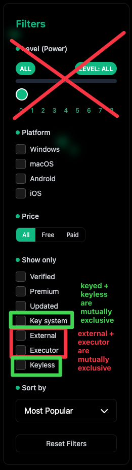
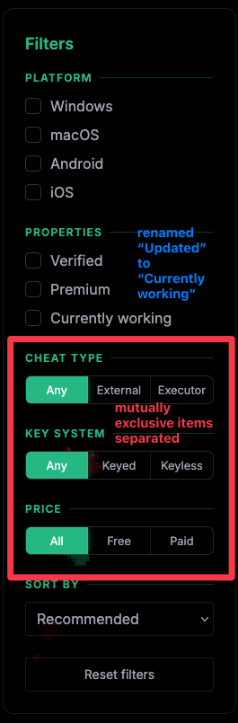

# Changes/Comparison with the old version of the voxlis.NET site

This document outlines some of the changes compared to the original site, before it got remade with Sklair (this current version of the site). Not everything is documented here, otherwise the list would be extensive; only the interesting and somewhat documentable stuff will be listed here.

## Incorrect usage of OpenGraph+Twitter (`og:image` and `twitter:image`) meta tags

The old site incorrectly uses both tags, specifically for declaring an image (preview) for displaying in social media. These tags do not accept relative URLs - they must be absolute.

## Filtering section

The filtering section was an entire mess, containing an entire section pertaining to execution levels (which, no longer formally exist) and then the "show only" section allowing users to select multiple items which are mutually exclusive.

The example is as follows:

To fix these issues, the level filtering option has been completely removed, and the "Show only" section has been separated into three distinct categories, "properties", "cheat type", and "key system". The price section has been moved to the bottom so that it stays close to the key system category for logical grouping.

The use of segmented buttons here instead of a checklist not only saves vertical space which is a plus, but it also makes it look more polished and also removed the fallacy that you can supposedly filter using mutually exclusive items.

Do note however that the image above (the new version) is just a screenshot of the first version, it is not finalised yet.
