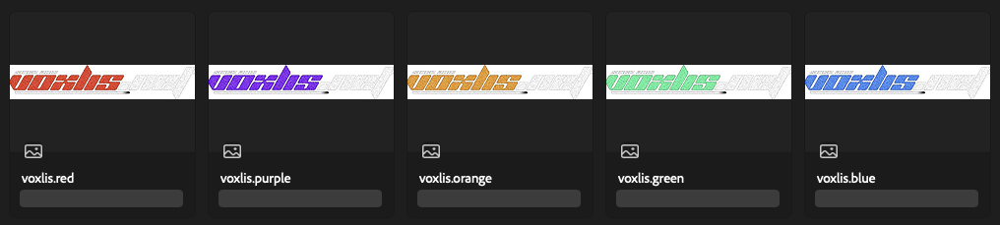

# READ THIS PART

This document is heavily outdated and **stopped being written ages ago**, since there were too many changes to document, and realistically coming back here to document every single change would have just made development slower. If you really care about all the meaningful changes, it is best to look at the commits and/or contact [Richy-Z](https://github.com/Richy-Z) for any explanations about implementation and the hard design decisions that were made along the way.

# Changes/Comparison with the old version of the voxlis.NET site

This document outlines some of the changes compared to the original site, before it got remade with Sklair (this current version of the site). <!-- Not everything is documented here, otherwise the list would be extensive; only the interesting and somewhat documentable stuff will be listed here. -->

## Incorrect usage of OpenGraph+Twitter (`og:image` and `twitter:image`) meta tags

The old site incorrectly uses both tags, specifically for declaring an image (preview) for displaying in social media. These tags do not accept relative URLs - they must be absolute.

<!-- mutual exclusion does not matter in filtering -->
<!-- ## Filtering section

The filtering section was an entire mess, containing an entire section pertaining to execution levels (which, no longer formally exist) and then the "show only" section allowing users to select multiple items which are mutually exclusive.

The example is as follows:

To fix these issues, the level filtering option has been completely removed, and the "Show only" section has been separated into three distinct categories, "properties", "cheat type", and "key system". The price section has been moved to the bottom so that it stays close to the key system category for logical grouping.

The use of segmented buttons here instead of a checklist not only saves vertical space which is a plus, but it also makes it look more polished and also removed the fallacy that you can supposedly filter using mutually exclusive items.

Do note however that the image above (the new version) is just a screenshot of the first version, it is not finalised yet. -->

## Voxlis logo dimensions

All the original voxlis logo files contained a lot of empty space (transparency) and this would just cause a bunch of inconveniences in trying to exactly align the logo with text. It was possible to simply just add an empty div which occupied a few pixels of space to fix alignment, but doing that everywhere across the site would be counterproductive.

The fix was to simply remove all of the transparent space with Photoshop.

